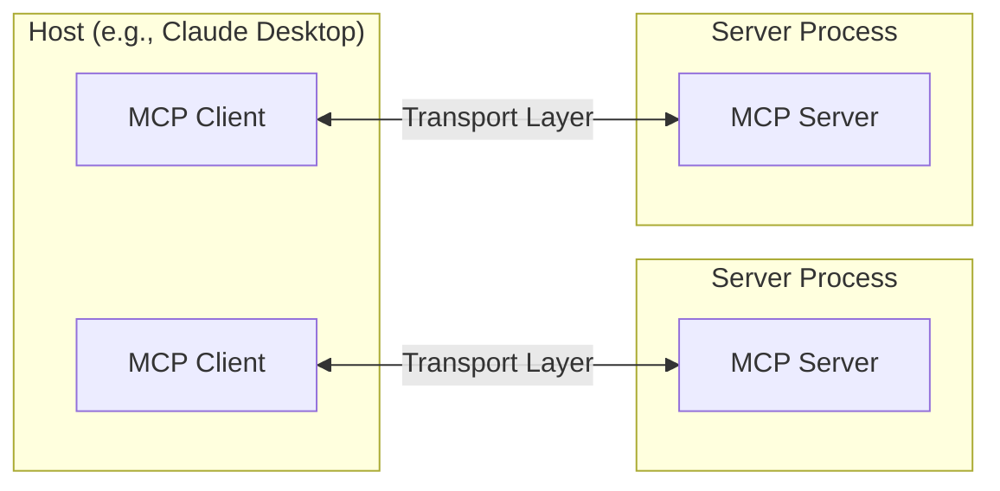
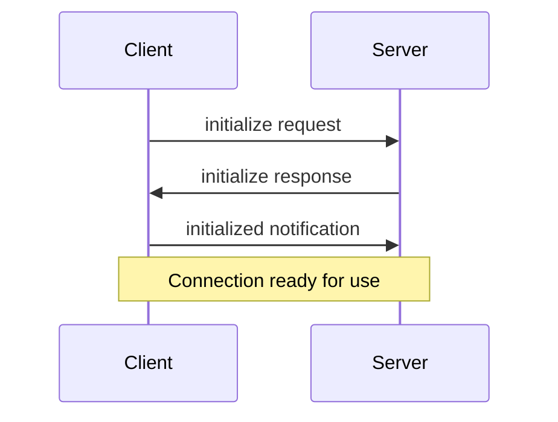

# Core architecture

Understand how MCP connects clients, servers, and LLMs

The Model Context Protocol (MCP) is built on a flexible, extensible architecture that enables seamless communication between LLM applications and integrations. This document covers the core architectural components and concepts.

## Overview

MCP follows a client-server architecture where:

*   **Hosts** are LLM applications (like Claude Desktop or IDEs) that initiate connections
*   **Clients** maintain 1:1 connections with servers, inside the host application
*   **Servers** provide context, tools, and prompts to clients



## Core components

### Protocol layer

The protocol layer handles message framing, request/response linking, and high-level communication patterns.

<Tabs>
  <Tab title="TypeScript">
    ```typescript
    class Protocol<Request, Notification, Result> {
        // Handle incoming requests
        setRequestHandler<T>(schema: T, handler: (request: T, extra: RequestHandlerExtra) => Promise<Result>): void

        // Handle incoming notifications
        setNotificationHandler<T>(schema: T, handler: (notification: T) => Promise<void>): void

        // Send requests and await responses
        request<T>(request: Request, schema: T, options?: RequestOptions): Promise<T>

        // Send one-way notifications
        notification(notification: Notification): Promise<void>
    }
    ```
  </Tab>

  <Tab title="Python">
    ```python
    class Session(BaseSession[RequestT, NotificationT, ResultT]):
        async def send_request(
            self,
            request: RequestT,
            result_type: type[Result]
        ) -> Result:
            """
            Send request and wait for response. Raises McpError if response contains error.
            """
            # Request handling implementation

        async def send_notification(
            self,
            notification: NotificationT
        ) -> None:
            """Send one-way notification that doesn't expect response."""
            # Notification handling implementation

        async def _received_request(
            self,
            responder: RequestResponder[ReceiveRequestT, ResultT]
        ) -> None:
            """Handle incoming request from other side."""
            # Request handling implementation

        async def _received_notification(
            self,
            notification: ReceiveNotificationT
        ) -> None:
            """Handle incoming notification from other side."""
            # Notification handling implementation
    ```
  </Tab>
</Tabs>

Key classes include:

*   `Protocol`
*   `Client`
*   `Server`

### Transport layer

The transport layer handles the actual communication between clients and servers. MCP supports multiple transport mechanisms:

1.  **Stdio transport**
    *   Uses standard input/output for communication
    *   Ideal for local processes

2.  **HTTP with SSE transport**
    *   Uses Server-Sent Events for server-to-client messages
    *   HTTP POST for client-to-server messages

All transports use [JSON-RPC](https://www.jsonrpc.org/) 2.0 to exchange messages. See the [specification](https://spec.modelcontextprotocol.io) for detailed information about the Model Context Protocol message format.

### Message types

MCP has these main types of messages:

1.  **Requests** expect a response from the other side:
    ```typescript
    interface Request {
      method: string;
      params?: { ... };
    }
    ```

2.  **Results** are successful responses to requests:
    ```typescript
    interface Result {
      [key: string]: unknown;
    }
    ```

3.  **Errors** indicate that a request failed:
    ```typescript
    interface Error {
      code: number;
      message: string;
      data?: unknown;
    }
    ```

4.  **Notifications** are one-way messages that don't expect a response:
    ```typescript
    interface Notification {
      method: string;
      params?: { ... };
    }
    ```

## Connection lifecycle

### 1. Initialization



1.  Client sends `initialize` request with protocol version and capabilities
2.  Server responds with its protocol version and capabilities
3.  Client sends `initialized` notification as acknowledgment
4.  Normal message exchange begins

### 2. Message exchange

After initialization, the following patterns are supported:

*   **Request-Response**: Client or server sends requests, the other responds
*   **Notifications**: Either party sends one-way messages

### 3. Termination

Either party can terminate the connection:

*   Clean shutdown via `close()`
*   Transport disconnection
*   Error conditions

## Error handling

MCP defines these standard error codes:

```typescript
enum ErrorCode {
  // Standard JSON-RPC error codes
  ParseError = -32700,
  InvalidRequest = -32600,
  MethodNotFound = -32601,
  InvalidParams = -32602,
  InternalError = -32603
}
```

SDKs and applications can define their own error codes above -32000.

Errors are propagated through:

*   Error responses to requests
*   Error events on transports
*   Protocol-level error handlers

## Implementation example

Here's a basic example of implementing an MCP server:

<Tabs>
  <Tab title="Python">
    ```python
    import asyncio
    import mcp.types as types
    from mcp.server import Server
    from mcp.server.stdio import stdio_server

    app = Server("example-server")

    @app.list_resources()
    async def list_resources() -> list[types.Resource]:
        return [
            types.Resource(
                uri="example://resource",
                name="Example Resource"
            )
        ]

    async def main():
        async with stdio_server() as streams:
            await app.run(
                streams[0],
                streams[1],
                app.create_initialization_options()
            )

    if __name__ == "__main__":
        asyncio.run(main)
    ```
  </Tab>
</Tabs>

# Prompts

Create reusable prompt templates and workflows

Prompts enable servers to define reusable prompt templates and workflows that clients can easily surface to users and LLMs. They provide a powerful way to standardize and share common LLM interactions.

<Note>
  Prompts are designed to be **user-controlled**, meaning they are exposed from servers to clients with the intention of the user being able to explicitly select them for use.
</Note>

## Overview

Prompts in MCP are predefined templates that can:

*   Accept dynamic arguments
*   Include context from resources
*   Chain multiple interactions
*   Guide specific workflows
*   Surface as UI elements (like slash commands)

## Prompt structure

Each prompt is defined with:

```python class PromptSchema:
    name: str               # Unique identifier for the prompt
    description: str | None # Human-readable description
    arguments: list[dict] | None # Optional list of arguments
    # Each argument has:
    # {
    #     name: str,            # Argument identifier
    #     description: str,     # Argument description
    #     required: bool,       # Whether argument is required
    # }
```
## Discovering prompts
# Clients can discover available prompts through the `prompts/list` endpoint:

# Request
```python
{
    "method": "prompts/list"
}
# Response
{
    "prompts": [
        {
            "name": "analyze-code",
            "description": "Analyze code for potential improvements",
            "arguments": [
                {
                    "name": "language",
                    "description": "Programming language",
                    "required": True
                }
            ]
        }
    ]
}
```

## Using prompts
# To use a prompt, clients make a `prompts/get` request:

# Request
{
  method: "prompts/get",
  params: {
    name: "analyze-code",
    arguments: {
      language: "python"
    }
  }
}

# Response
{
  description: "Analyze Python code for potential improvements",
  messages: [
    {
      role: "user",
      content: {
        type: "text",
        text: "Please analyze the following Python code for potential improvements:\n\n```python \ndef calculate_sum(numbers):\n    total = 0\n    for num in numbers:\n        total = total + num\n    return total\n\nresult = calculate_sum([1, 2, 3, 4, 5])\nprint(result)\n```"
      }
    }
  ]
}


## Dynamic prompts

Prompts can be dynamic and include:

### Embedded resource context

```json
{
  "name": "analyze-project",
  "description": "Analyze project logs and code",
  "arguments": [
    {
      "name": "timeframe",
      "description": "Time period to analyze logs",
      "required": true
    },
    {
      "name": "fileUri",
      "description": "URI of code file to review",
      "required": true
    }
  ]
}
```

When handling the `prompts/get` request:

```json
{
  "messages": [
    {
      "role": "user",
      "content": {
        "type": "text",
        "text": "Analyze these system logs and the code file for any issues:"
      }
    },
    {
      "role": "user",
      "content": {
        "type": "resource",
        "resource": {
          "uri": "logs://recent?timeframe=1h",
          "text": "[2024-03-14 15:32:11] ERROR: Connection timeout in network.py:127\n[2024-03-14 15:32:15] WARN: Retrying connection (attempt 2/3)\n[2024-03-14 15:32:20] ERROR: Max retries exceeded",
          "mimeType": "text/plain"
        }
      }
    },
    {
      "role": "user",
      "content": {
        "type": "resource",
        "resource": {
          "uri": "file:///path/to/code.py",
          "text": "def connect_to_service(timeout=30):\n    retries = 3\n    for attempt in range(retries):\n        try:\n            return establish_connection(timeout)\n        except TimeoutError:\n            if attempt == retries - 1:\n                raise\n            time.sleep(5)\n\ndef establish_connection(timeout):\n    # Connection implementation\n    pass",
          "mimeType": "text/x-python"
        }
      }
    }
  ]
}
```

### Multi-step workflows

```typescript
const debugWorkflow = {
  name: "debug-error",
  async getMessages(error: string) {
    return [
      {
        role: "user",
        content: {
          type: "text",
          text: `Here's an error I'm seeing: ${error}`
        }
      },
      {
        role: "assistant",
        content: {
          type: "text",
          text: "I'll help analyze this error. What have you tried so far?"
        }
      },
      {
        role: "user",
        content: {
          type: "text",
          text: "I've tried restarting the service, but the error persists."
        }
      }
    ];
  }
};
```

## Example implementation

Here's a complete example of implementing prompts in an MCP server:

<Tabs>
    <Tab title="Python">
    ```python
    from mcp.server import Server
    import mcp.types as types

    # Define available prompts
    PROMPTS = {
        "git-commit": types.Prompt(
            name="git-commit",
            description="Generate a Git commit message",
            arguments=[
                types.PromptArgument(
                    name="changes",
                    description="Git diff or description of changes",
                    required=True
                )
            ],
        ),
        "explain-code": types.Prompt(
            name="explain-code",
            description="Explain how code works",
            arguments=[
                types.PromptArgument(
                    name="code",
                    description="Code to explain",
                    required=True
                ),
                types.PromptArgument(
                    name="language",
                    description="Programming language",
                    required=False
                )
            ],
        )
    }

    # Initialize server
    app = Server("example-prompts-server")

    @app.list_prompts()
    async def list_prompts() -> list[types.Prompt]:
        return list(PROMPTS.values())

    @app.get_prompt()
    async def get_prompt(
        name: str, arguments: dict[str, str] | None = None
    ) -> types.GetPromptResult:
        if name not in PROMPTS:
            raise ValueError(f"Prompt not found: {name}")

        if name == "git-commit":
            changes = arguments.get("changes") if arguments else ""
            return types.GetPromptResult(
                messages=[
                    types.PromptMessage(
                        role="user",
                        content=types.TextContent(
                            type="text",
                            text=f"Generate a concise but descriptive commit message "
                            f"for these changes:\n\n{changes}"
                        )
                    )
                ]
            )

        if name == "explain-code":
            code = arguments.get("code") if arguments else ""
            language = arguments.get("language", "Unknown") if arguments else "Unknown"
            return types.GetPromptResult(
                messages=[
                    types.PromptMessage(
                        role="user",
                        content=types.TextContent(
                            type="text",
                            text=f"Explain how this {language} code works:\n\n{code}"
                        )
                    )
                ]
            )

        raise ValueError("Prompt implementation not found")
    ```
  </Tab>
</Tabs>

## Best practices

When implementing prompts:

1.  Use clear, descriptive prompt names
2.  Provide detailed descriptions for prompts and arguments
3.  Validate all required arguments
4.  Handle missing arguments gracefully
5.  Consider versioning for prompt templates
6.  Cache dynamic content when appropriate
7.  Implement error handling
8.  Document expected argument formats
9.  Consider prompt composability
10. Test prompts with various inputs

## UI integration

Prompts can be surfaced in client UIs as:

*   Slash commands
*   Quick actions
*   Context menu items
*   Command palette entries
*   Guided workflows
*   Interactive forms

## Updates and changes

Servers can notify clients about prompt changes:

1.  Server capability: `prompts.listChanged`
2.  Notification: `notifications/prompts/list_changed`
3.  Client re-fetches prompt list

## Security considerations

When implementing prompts:

*   Validate all arguments
*   Sanitize user input

# Resources

Expose data and content from your servers to LLMs

Resources are a core primitive in the Model Context Protocol (MCP) that allow servers to expose data and content that can be read by clients and used as context for LLM interactions.

<Note>
  Resources are designed to be **application-controlled**, meaning that the client application can decide how and when they should be used.
  Different MCP clients may handle resources differently. For example:

  *   Claude Desktop currently requires users to explicitly select resources before they can be used
  *   Other clients might automatically select resources based on heuristics
  *   Some implementations may even allow the AI model itself to determine which resources to use

  Server authors should be prepared to handle any of these interaction patterns when implementing resource support. In order to expose data to models automatically, server authors should use a **model-controlled** primitive such as [Tools](./tools).
</Note>

## Overview

Resources represent any kind of data that an MCP server wants to make available to clients. This can include:

*   File contents
*   Database records
*   API responses
*   Live system data
*   Screenshots and images
*   Log files
*   And more

Each resource is identified by a unique URI and can contain either text or binary data.

## Resource URIs

Resources are identified using URIs that follow this format:

```
[protocol]://[host]/[path]
```

For example:

*   `file:///home/user/documents/report.pdf`
*   `postgres://database/customers/schema`
*   `screen://localhost/display1`

The protocol and path structure is defined by the MCP server implementation. Servers can define their own custom URI schemes.

## Resource types

Resources can contain two types of content:

### Text resources

Text resources contain UTF-8 encoded text data. These are suitable for:

*   Source code
*   Configuration files
*   Log files
*   JSON/XML data
*   Plain text

### Binary resources

Binary resources contain raw binary data encoded in base64. These are suitable for:

*   Images
*   PDFs
*   Audio files
*   Video files
*   Other non-text formats

## Resource discovery

Clients can discover available resources through two main methods:

### Direct resources

Servers expose a list of concrete resources via the `resources/list` endpoint. Each resource includes:

```typescript
{
  uri: string;           // Unique identifier for the resource
  name: string;          // Human-readable name
  description?: string;  // Optional description
  mimeType?: string;     // Optional MIME type
}
```

### Resource templates

For dynamic resources, servers can expose [URI templates](https://datatracker.ietf.org/doc/html/rfc6570) that clients can use to construct valid resource URIs:

```typescript
{
  uriTemplate: string;   // URI template following RFC 6570
  name: string;          // Human-readable name for this type
  description?: string;  // Optional description
  mimeType?: string;     // Optional MIME type for all matching resources
}
```

## Reading resources

To read a resource, clients make a `resources/read` request with the resource URI.

The server responds with a list of resource contents:

```typescript
{
  contents: [
    {
      uri: string;        // The URI of the resource
      mimeType?: string;  // Optional MIME type

      // One of:
      text?: string;      // For text resources
      blob?: string;      // For binary resources (base64 encoded)
    }
  ]
}
```

<Tip>
  Servers may return multiple resources in response to one `resources/read` request. This could be used, for example, to return a list of files inside a directory when the directory is read.
</Tip>

# Roots

Understanding roots in MCP

Roots are a concept in MCP that define the boundaries where servers can operate. They provide a way for clients to inform servers about relevant resources and their locations.

## What are Roots?

A root is a URI that a client suggests a server should focus on. When a client connects to a server, it declares which roots the server should work with. While primarily used for filesystem paths, roots can be any valid URI including HTTP URLs.

For example, roots could be:

```
file:///home/user/projects/myapp
https://api.example.com/v1
```

## Why Use Roots?

Roots serve several important purposes:

1.  **Guidance**: They inform servers about relevant resources and locations
2.  **Clarity**: Roots make it clear which resources are part of your workspace
3.  **Organization**: Multiple roots let you work with different resources simultaneously

## How Roots Work

When a client supports roots, it:

1.  Declares the `roots` capability during connection
2.  Provides a list of suggested roots to the server
3.  Notifies the server when roots change (if supported)

While roots are informational and not strictly enforcing, servers should:

1.  Respect the provided roots
2.  Use root URIs to locate and access resources
3.  Prioritize operations within root boundaries

## Common Use Cases

Roots are commonly used to define:

*   Project directories
*   Repository locations
*   API endpoints
*   Configuration locations
*   Resource boundaries

## Best Practices

When working with roots:

1.  Only suggest necessary resources
2.  Use clear, descriptive names for roots
3.  Monitor root accessibility
4.  Handle root changes gracefully

## Example

Here's how a typical MCP client might expose roots:

```json
{
  "roots": [
    {
      "uri": "file:///home/user/projects/frontend",
      "name": "Frontend Repository"
    },
    {
      "uri": "https://api.example.com/v1",
      "name": "API Endpoint"
    }
  ]
}
```

This configuration suggests the server focus on both a local repository and an API endpoint while keeping them logically separated.

# Tools

Enable LLMs to perform actions through your server

Tools are a powerful primitive in the Model Context Protocol (MCP) that enable servers to expose executable functionality to clients. Through tools, LLMs can interact with external systems, perform computations, and take actions in the real world.

<Note>
  Tools are designed to be **model-controlled**, meaning that tools are exposed from servers to clients with the intention of the AI model being able to automatically invoke them (with a human in the loop to grant approval).
</Note>

## Overview

Tools in MCP allow servers to expose executable functions that can be invoked by clients and used by LLMs to perform actions. Key aspects of tools include:

*   **Discovery**: Clients can list available tools through the `tools/list` endpoint
*   **Invocation**: Tools are called using the `tools/call` endpoint, where servers perform the requested operation and return results
*   **Flexibility**: Tools can range from simple calculations to complex API interactions

Like [resources](/docs/concepts/resources), tools are identified by unique names and can include descriptions to guide their usage. However, unlike resources, tools represent dynamic operations that can modify state or interact with external systems.

## Tool definition structure

Each tool is defined with the following structure:

```typescript
{
  name: string;          // Unique identifier for the tool
  description?: string;  // Human-readable description
  inputSchema: {         // JSON Schema for the tool's parameters
    type: "object",
    properties: { ... }  // Tool-specific parameters
  }
}
```

## Implementing tools

Here's an example of implementing a basic tool in an MCP server:

<Tabs>
   <Tab title="Python">
    ```python
    app = Server("example-server")

    @app.list_tools()
    async def list_tools() -> list[types.Tool]:
        return [
            types.Tool(
                name="calculate_sum",
                description="Add two numbers together",
                inputSchema={
                    "type": "object",
                    "properties": {
                        "a": {"type": "number"},
                        "b": {"type": "number"}
                    },
                    "required": ["a", "b"]
                }
            )
        ]

    @app.call_tool()
    async def call_tool(
        name: str,
        arguments: dict
    ) -> list[types.TextContent | types.ImageContent | types.EmbeddedResource]:
        if name == "calculate_sum":
            a = arguments["a"]
            b = arguments["b"]
            result = a + b
            return [types.TextContent(type="text", text=str(result))]
        raise ValueError(f"Tool not found: {name}")
    ```
  </Tab>
</Tabs>

## Example tool patterns

Here are some examples of types of tools that a server could provide:

### System operations

Tools that interact with the local system:

```typescript
{
  name: "execute_command",
  description: "Run a shell command",
  inputSchema: {
    type: "object",
    properties: {
      command: { type: "string" },
      args: { type: "array", items: { type: "string" } }
    }
  }
}
```

### API integrations

Tools that wrap external APIs:

```typescript
{
  name: "github_create_issue",
  description: "Create a GitHub issue",
  inputSchema: {
    type: "object",
    properties: {
      title: { type: "string" },
      body: { type: "string" },
      labels: { type: "array", items: { type: "string" } }
    }
  }
}
```

### Data processing

Tools that transform or analyze data:

```typescript
{
  name: "analyze_csv",
  description: "Analyze a CSV file",
  inputSchema: {
    type: "object",
    properties: {
      filepath: { type: "string" },
      operations: {
        type: "array",
        items: {
          enum: ["sum", "average", "count"]
        }
      }
    }
  }
}
```

## Best practices

When implementing tools:

1.  Provide clear, descriptive names and descriptions
2.  Use detailed JSON Schema definitions for parameters
3.  Include examples in tool descriptions to demonstrate how the model should use them
4.  Implement proper error handling and validation
5.  Use progress reporting for long operations
6.  Keep tool operations focused and atomic
7.  Document expected return value structures
8.  Implement proper timeouts
9.  Consider rate limiting for resource-intensive operations
10. Log tool usage for debugging and monitoring

## Tool discovery and updates

MCP supports dynamic tool discovery:

1.  Clients can list available tools at any time
2.  Servers can notify clients when tools change using `notifications/tools/list_changed`
3.  Tools can be added or removed during runtime
4.  Tool definitions can be updated (though this should be done carefully)

## Error handling

Tool errors should be reported within the result object, not as MCP protocol-level errors. This allows the LLM to see and potentially handle the error. When a tool encounters an error:

1.  Set `isError` to `true` in the result
2.  Include error details in the `content` array

Here's an example of proper error handling for tools:

<Tabs>
    <Tab title="Python">
    ```python
    try:
        # Tool operation
        result = perform_operation()
        return types.CallToolResult(
            content=[
                types.TextContent(
                    type="text",
                    text=f"Operation successful: {result}"
                )
            ]
        )
    except Exception as error:
        return types.CallToolResult(
            isError=True,
            content=[
                types.TextContent(
                    type="text",
                    text=f"Error: {str(error)}"
                )
            ]
        )
    ```
  </Tab>
</Tabs>

This approach allows the LLM to see that an error occurred and potentially take corrective action or request human intervention.

## Testing tools

A comprehensive testing strategy for MCP tools should cover:

*   **Functional testing**: Verify tools execute correctly with valid inputs and handle invalid inputs appropriately

# Transports

Learn about MCP's communication mechanisms

Transports in the Model Context Protocol (MCP) provide the foundation for communication between clients and servers. A transport handles the underlying mechanics of how messages are sent and received.

## Message Format

MCP uses [JSON-RPC](https://www.jsonrpc.org/) 2.0 as its wire format. The transport layer is responsible for converting MCP protocol messages into JSON-RPC format for transmission and converting received JSON-RPC messages back into MCP protocol messages.

There are three types of JSON-RPC messages used:

### Requests

```typescript
{
  jsonrpc: "2.0",
  id: number | string,
  method: string,
  params?: object
}
```

### Responses

```typescript
{
  jsonrpc: "2.0",
  id: number | string,
  result?: object,
  error?: {
    code: number,
    message: string,
    data?: unknown
  }
}
```

### Notifications

```typescript
{
  jsonrpc: "2.0",
  method: string,
  params?: object
}
```

## Built-in Transport Types

MCP includes two standard transport implementations:

### Standard Input/Output (stdio)

The stdio transport enables communication through standard input and output streams. This is particularly useful for local integrations and command-line tools.

Use stdio when:

*   Building command-line tools
*   Implementing local integrations
*   Needing simple process communication
*   Working with shell scripts

<Tabs>

  <Tab title="Python (Server)">
    ```python
    app = Server("example-server")

    async with stdio_server() as streams:
        await app.run(
            streams[0],
            streams[1],
            app.create_initialization_options()
        )
    ```
  </Tab>

  <Tab title="Python (Client)">
    ```python
    params = StdioServerParameters(
        command="./server",
        args=["--option", "value"]
    )

    async with stdio_client(params) as streams:
        async with ClientSession(streams[0], streams[1]) as session:
            await session.initialize()
    ```
  </Tab>
</Tabs>

## Error Handling

Transport implementations should handle various error scenarios:

1.  Connection errors
2.  Message parsing errors
3.  Protocol errors
4.  Network timeouts
5.  Resource cleanup

Example error handling:

<Tabs>
   <Tab title="Python">
    Note that while MCP Servers are often implemented with asyncio, we recommend
    implementing low-level interfaces like transports with `anyio` for wider compatibility.

    ```python
    @contextmanager
    async def example_transport(scope: Scope, receive: Receive, send: Send):
        try:
            # Create streams for bidirectional communication
            read_stream_writer, read_stream = anyio.create_memory_object_stream(0)
            write_stream, write_stream_reader = anyio.create_memory_object_stream(0)

            async def message_handler():
                try:
                    async with read_stream_writer:
                        # Message handling logic
                        pass
                except Exception as exc:
                    logger.error(f"Failed to handle message: {exc}")
                    raise exc

            async with anyio.create_task_group() as tg:
                tg.start_soon(message_handler)
                try:
                    # Yield streams for communication
                    yield read_stream, write_stream
                except Exception as exc:
                    logger.error(f"Transport error: {exc}")
                    raise exc
                finally:
                    tg.cancel_scope.cancel()
                    await write_stream.aclose()
                    await read_stream.aclose()
        except Exception as exc:
            logger.error(f"Failed to initialize transport: {exc}")
            raise exc
    ```
  </Tab>
</Tabs>

## Best Practices

When implementing or using MCP transport:

1.  Handle connection lifecycle properly
2.  Implement proper error handling
3.  Clean up resources on connection close
4.  Use appropriate timeouts
5.  Validate messages before sending
6.  Log transport events for debugging
7.  Implement reconnection logic when appropriate
8.  Handle backpressure in message queues

Tips for debugging transport issues:

1.  Enable debug logging
2.  Monitor message flow
3.  Check connection states
4.  Validate message formats
5.  Test error scenarios
6.  Use network analysis tools
7.  Implement health checks
8.  Monitor resource usage
9.  Test edge cases
10. Use proper error tracking

## Common issues

### Working directory

When using MCP servers with Claude Desktop:

*   The working directory for servers launched via `claude_desktop_config.json` may be undefined (like `/` on macOS) since Claude Desktop could be started from anywhere
*   Always use absolute paths in your configuration and `.env` files to ensure reliable operation
*   For testing servers directly via command line, the working directory will be where you run the command

For example in `claude_desktop_config.json`, use:

```json
{
  "command": "npx",
  "args": ["-y", "@modelcontextprotocol/server-filesystem", "/Users/username/data"]
}
```

Instead of relative paths like `./data`

### Environment variables

MCP servers inherit only a subset of environment variables automatically, like `USER`, `HOME`, and `PATH`.

To override the default variables or provide your own, you can specify an `env` key in `claude_desktop_config.json`:

```json
{
  "myserver": {
    "command": "mcp-server-myapp",
    "env": {
      "MYAPP_API_KEY": "some_key",
    }
  }
}
```

### Server initialization

Common initialization problems:

1.  **Path Issues**
    *   Incorrect server executable path
    *   Missing required files
    *   Permission problems
    *   Try using an absolute path for `command`

2.  **Configuration Errors**
    *   Invalid JSON syntax
    *   Missing required fields
    *   Type mismatches

3.  **Environment Problems**
    *   Missing environment variables
    *   Incorrect variable values
    *   Permission restrictions

### Connection problems

When servers fail to connect:

1.  Check Claude Desktop logs
2.  Verify server process is running
3.  Test standalone with [Inspector](/docs/tools/inspector)
4.  Verify protocol compatibility

## Implementing logging

### Server-side logging

When building a server that uses the local stdio [transport](/docs/concepts/transports), all messages logged to stderr (standard error) will be captured by the host application (e.g., Claude Desktop) automatically.

<Warning>
  Local MCP servers should not log messages to stdout (standard out), as this will interfere with protocol operation.
</Warning>

For all [transports](/docs/concepts/transports), you can also provide logging to the client by sending a log message notification:

<Tabs>
  <Tab title="Python">
    ```python
    server.request_context.session.send_log_message(
      level="info",
      data="Server started successfully",
    )
    ```
  </Tab>
</Tabs>

Important events to log:

*   Initialization steps
*   Resource access
*   Tool execution
*   Error conditions
*   Performance metrics

### Client-side logging

In client applications:

1.  Enable debug logging
2.  Monitor network traffic
3.  Track message exchanges
4.  Record error states

# Inspector

In-depth guide to using the MCP Inspector for testing and debugging Model Context Protocol servers

The [MCP Inspector](https://github.com/modelcontextprotocol/inspector) is an interactive developer tool for testing and debugging MCP servers. While the [Debugging Guide](/docs/tools/debugging) covers the Inspector as part of the overall debugging toolkit, this document provides a detailed exploration of the Inspector's features and capabilities.

## Getting started

### Installation and basic usage

The Inspector runs directly through `npx` without requiring installation:

```bash
npx @modelcontextprotocol/inspector <command>
```

```bash
npx @modelcontextprotocol/inspector <command> <arg1> <arg2>
```

#### Inspecting servers from NPM or PyPi

A common way to start server packages from [NPM](https://npmjs.com) or [PyPi](https://pypi.com).

<Tabs>

  <Tab title="PyPi package">
    ```bash
    npx @modelcontextprotocol/inspector uvx <package-name> <args>
    # For example
    npx @modelcontextprotocol/inspector uvx mcp-server-git --repository ~/code/mcp/servers.git
    ```
  </Tab>
</Tabs>

#### Inspecting locally developed servers

To inspect servers locally developed or downloaded as a repository, the most common
way is:

<Tabs>

  <Tab title="Python">
    ```bash
    npx @modelcontextprotocol/inspector \
      uv \
      --directory path/to/server \
      run \
      package-name \
      args...
    ```
  </Tab>
</Tabs>