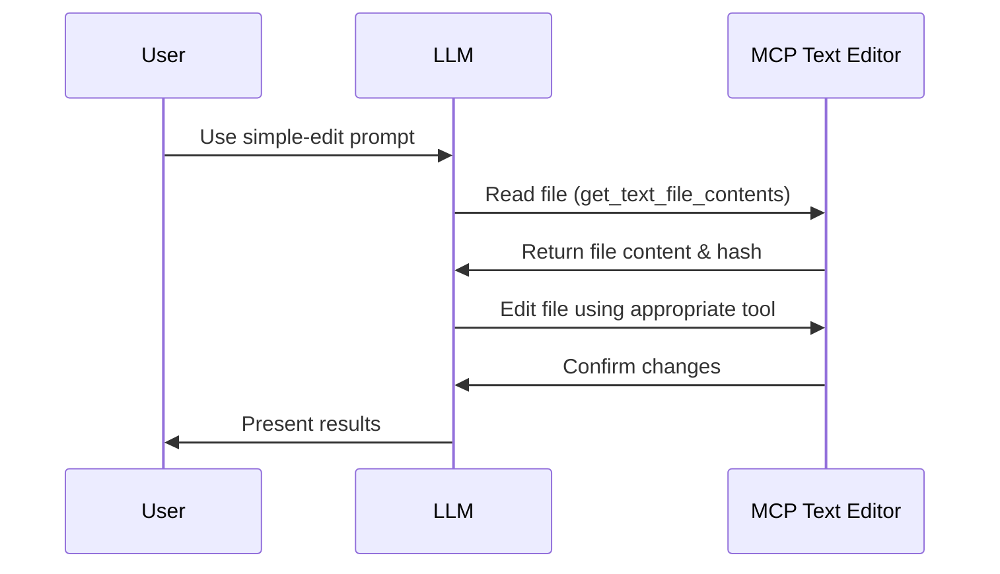
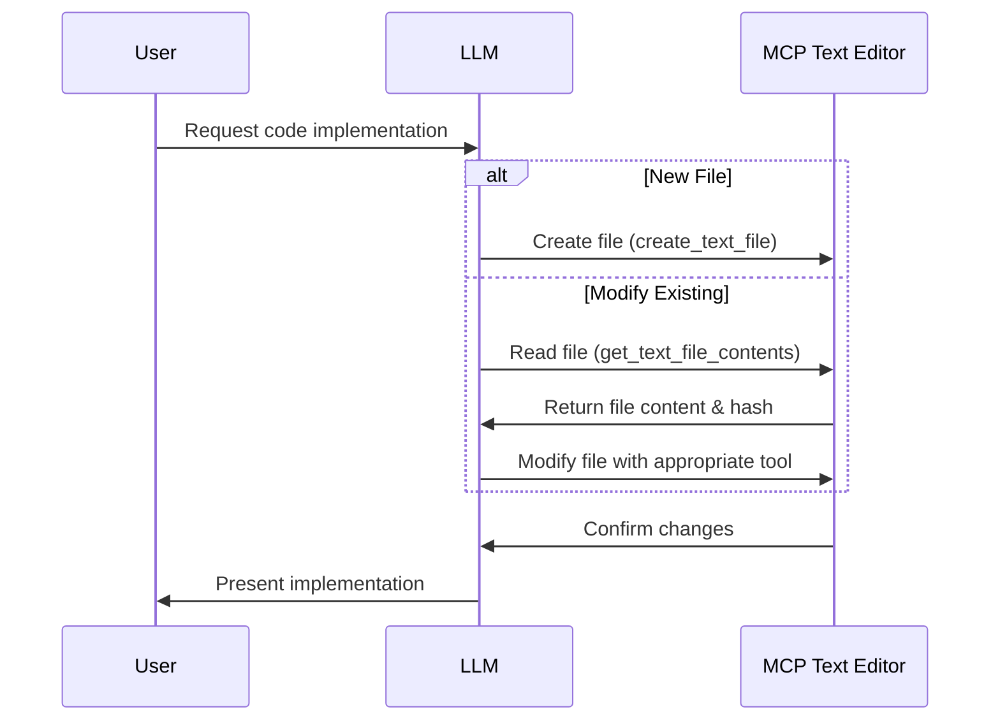
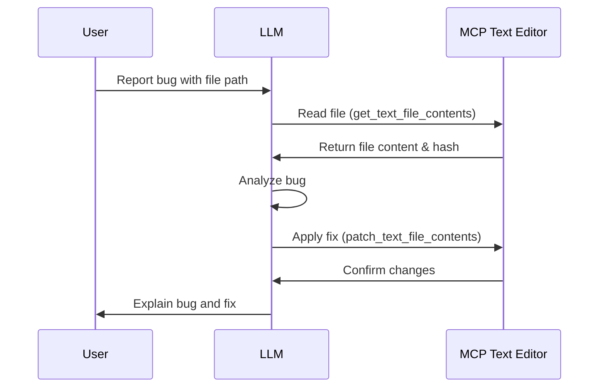
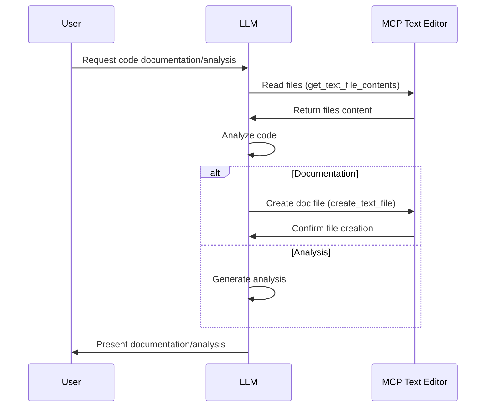

# MCP Text Editor Prompt Implementation Plan

This document outlines the implementation plan for improved prompt templates for the MCP Text Editor. These prompts aim to provide better guidance to Large Language Models (LLMs) for effectively using the text editing tools.

## Understanding MCP Text Editor Tools

The MCP Text Editor provides several key tools that LLMs can use:

1. **Reading Tools**:
   - `get_text_file_contents`: Read file contents with line ranges and get file hashes
   - Line range resource handler: Access file content through URIs

2. **Writing/Editing Tools**:
   - `create_text_file`: Create new text files
   - `patch_text_file_contents`: Apply patches with hash-based concurrency control
   - `insert_text_file_contents`: Insert text at specific positions
   - `append_text_file_contents`: Append text to the end of files
   - `delete_text_file_contents`: Delete specific line ranges

## Core Functions

The editor relies on several core functions:

- `read_file_contents`: Read content with line ranges
- `edit_file_contents`: Edit with hash-based conflict detection
- `insert_text_file_contents`: Insert text before/after specific lines 
- `delete_text_file_contents`: Delete ranges with conflict detection
- `read_multiple_ranges`: Read multiple ranges from different files
- `calculate_hash`: Generate content hashes for concurrency control

## Prompt Templates Implementation

Below are the detailed implementations for the prompt templates. These will be added to `serverPrompts.py`.

```python
from mcp.server import Server
from mcp.types import TextContent, Prompt, PromptArgument, PromptMessage, GetPromptResult
from typing import List, Dict, Any, Optional

# Initialize server 
app = Server("mcp-text-editor")

# Define available prompts
PROMPTS = {
    "simple-edit": Prompt(
        name="simple-edit",
        description="Simple file editing without arguments",
    ),
    
    "code-implement": Prompt(
        name="code-implement",
        description="Implement or enhance code based on requirements",
        arguments=[
            PromptArgument(
                name="task",
                description="Implementation task description",
                required=True
            ),
            PromptArgument(
                name="file_path",
                description="Target file path (existing or new)",
                required=False
            ),
            PromptArgument(
                name="language",
                description="Programming language",
                required=False
            )
        ]
    ),
    
    "fix-bug": Prompt(
        name="fix-bug",
        description="Help diagnose and fix bugs in code",
        arguments=[
            PromptArgument(
                name="issue",
                description="Description of the bug or issue",
                required=True
            ),
            PromptArgument(
                name="file_path",
                description="Path to the file containing the bug",
                required=True
            ),
            PromptArgument(
                name="error_message",
                description="Error message or stack trace, if available",
                required=False
            )
        ]
    ),
    
    "document-analyze": Prompt(
        name="document-analyze",
        description="Document or analyze code",
        arguments=[
            PromptArgument(
                name="file_paths",
                description="Comma-separated paths to the files to document/analyze",
                required=True
            ),
            PromptArgument(
                name="task",
                description="'document' for documentation, 'analyze' for analysis",
                required=True
            ),
            PromptArgument(
                name="output_path",
                description="Path for output documentation (if applicable)",
                required=False
            )
        ]
    )
}

@app.list_prompts()
async def list_prompts() -> List[Prompt]:
    """List available prompts."""
    return list(PROMPTS.values())

@app.get_prompt()
async def get_prompt(
    name: str, arguments: Dict[str, str] | None = None
) -> GetPromptResult:
    """Handle prompt requests."""
    if name not in PROMPTS:
        raise ValueError(f"Prompt not found: {name}")
    
    if arguments is None:
        arguments = {}
    
    if name == "simple-edit":
        return GetPromptResult(
            messages=[
                PromptMessage(
                    role="user",
                    content=TextContent(
                        type="text",
                        text="""I need help editing a text file using the MCP text editor tools.

To use these tools effectively, follow these steps:

1. First, use the "get_text_file_contents" tool to read the file content and obtain the file hash.
2. If you want to make changes, use the appropriate tool:
   - For creating new files: "create_text_file"
   - For replacing content: "patch_text_file_contents" (requires file hash)
   - For inserting at a position: "insert_text_file_contents"
   - For adding to the end: "append_text_file_contents"
   - For removing content: "delete_text_file_contents"

Please help me edit a file of my choice."""
                    )
                )
            ]
        )
    
    elif name == "code-implement":
        task = arguments.get("task", "[TASK]")
        file_path = arguments.get("file_path", "")
        language = arguments.get("language", "")
        
        file_path_text = f" in the file at {file_path}" if file_path else ""
        language_text = f" using {language}" if language else ""
        
        return GetPromptResult(
            messages=[
                PromptMessage(
                    role="user",
                    content=TextContent(
                        type="text",
                        text=f"""I need to implement the following{language_text}{file_path_text}:

{task}

Please help me with this implementation. Follow these steps:

1. First, read the existing code if needed using the "get_text_file_contents" tool
2. Understand the requirements and plan the implementation
3. If creating a new file:
   - Use "create_text_file" with the complete implementation
4. If modifying an existing file:
   - Use "get_text_file_contents" to get the current content and file hash
   - Use one of these tools to make changes:
     - "patch_text_file_contents" to replace sections (requires file hash and range hash)
     - "insert_text_file_contents" to add content at specific positions
     - "append_text_file_contents" to add content at the end
5. Verify the changes meet the requirements

Remember that all file paths must be absolute, and when patching files, you need the file hash and range hash for concurrency control."""
                    )
                ),
                PromptMessage(
                    role="assistant", 
                    content=TextContent(
                        type="text",
                        text="I'll help you implement this code. Let me break this down into steps."
                    )
                )
            ]
        )
    
    elif name == "fix-bug":
        issue = arguments.get("issue", "[ISSUE]")
        file_path = arguments.get("file_path", "[FILE_PATH]")
        error_message = arguments.get("error_message", "")
        
        error_text = f"\nThe error message is:\n```\n{error_message}\n```" if error_message else ""
        
        return GetPromptResult(
            messages=[
                PromptMessage(
                    role="user",
                    content=TextContent(
                        type="text",
                        text=f"""I need help fixing a bug in the file at {file_path}.

The issue is: {issue}{error_text}

Please help me diagnose and fix this issue. Follow these steps:

1. First, read the code using "get_text_file_contents" to understand the context
2. Analyze the code and identify the potential cause of the bug
3. Come up with a fix
4. Apply the fix using:
   - "patch_text_file_contents" to replace buggy sections
   - "insert_text_file_contents" to add missing code
   - "delete_text_file_contents" to remove problematic code
5. Explain the root cause and how the fix addresses it

Remember that file paths must be absolute, and when using patch_text_file_contents, you need the file hash and range hash for each section you're modifying."""
                    )
                ),
                PromptMessage(
                    role="assistant", 
                    content=TextContent(
                        type="text",
                        text="I'll help you fix this bug. Let me start by examining the code to understand what's happening."
                    )
                )
            ]
        )
    
    elif name == "document-analyze":
        file_paths = arguments.get("file_paths", "[FILE_PATHS]")
        task_type = arguments.get("task", "analyze")
        output_path = arguments.get("output_path", "")
        
        file_paths_list = file_paths.split(",")
        file_paths_formatted = "\n".join([f"- {path.strip()}" for path in file_paths_list])
        
        output_text = f"\nI'll generate the documentation at: {output_path}" if output_path and task_type == "document" else ""
        
        task_description = "documentation" if task_type == "document" else "analysis"
        
        return GetPromptResult(
            messages=[
                PromptMessage(
                    role="user",
                    content=TextContent(
                        type="text",
                        text=f"""I need {task_description} for the following files:
{file_paths_formatted}{output_text}

Please help me with this task. Follow these steps:

1. Read each file using "get_text_file_contents" to understand the codebase
2. {"Analyze the code structure, functionality, and potential issues" if task_type == "analyze" else "Create comprehensive documentation explaining the code"}
3. {"Provide a detailed analysis with recommendations" if task_type == "analyze" else f"Create a documentation file at {output_path if output_path else '[OUTPUT_PATH]'} using create_text_file"}

When analyzing code, focus on:
- Architecture and design patterns
- Potential bugs or issues
- Performance considerations
- Code quality and maintainability

When documenting code, include:
- Overview of functionality
- Function/method documentation
- Parameter descriptions
- Usage examples
- Important workflows

Remember to use "get_text_file_contents" for reading files and "create_text_file" for creating documentation files."""
                    )
                ),
                PromptMessage(
                    role="assistant", 
                    content=TextContent(
                        type="text",
                        text=f"I'll help you with the {task_description} of these files. Let me start by examining each file to understand the codebase."
                    )
                )
            ]
        )
    
    raise ValueError("Prompt implementation not found")
```

## Prompt Workflow Diagrams

### Simple Edit Workflow



### Code Implementation Workflow



### Bug Fixing Workflow



### Document/Analysis Workflow



## Implementation in `server.py`

To incorporate these prompts into the existing server.py file, we need to:

1. Import the new prompts module
2. Add the list_prompts() and get_prompt() methods

The full implementation would look like this in server.py:

```python
"""MCP Text Editor Server implementation."""

import logging
import traceback
from collections.abc import Sequence
from typing import Any, List

from mcp.server import Server
from mcp.types import Resource, ResourceTemplate, TextContent, Tool, Prompt, PromptArgument, GetPromptResult, PromptMessage

from .handlers import (
    AppendTextFileContentsHandler,
    CreateTextFileHandler,
    DeleteTextFileContentsHandler,
    GetTextFileContentsHandler,
    InsertTextFileContentsHandler,
    PatchTextFileContentsHandler,
)
from .handlers.line_range_resource_handler import LineRangeResourceHandler
from .version import __version__
from .serverPrompts import PROMPTS, list_prompts, get_prompt

# Configure logging
logging.basicConfig(level=logging.CRITICAL)
logger = logging.getLogger("mcp-text-editor")

app = Server("mcp-text-editor")
# Initialize handlers
get_contents_handler = GetTextFileContentsHandler()
patch_file_handler = PatchTextFileContentsHandler()
create_file_handler = CreateTextFileHandler()
append_file_handler = AppendTextFileContentsHandler()
delete_contents_handler = DeleteTextFileContentsHandler()
insert_file_handler = InsertTextFileContentsHandler()
line_range_handler = LineRangeResourceHandler()


@app.read_resource()
async def read_resource(uri: str) -> TextContent:
    """Handle resource read requests."""
    logger.info(f"Reading resource: {uri}")
    try:
        return await line_range_handler.handle_resource(uri)
    except ValueError as e:
        logger.error(f"Invalid resource URI: {str(e)}")
        raise
    except Exception as e:
        logger.error(traceback.format_exc())
        raise RuntimeError(f"Error reading resource: {str(e)}") from e


@app.list_resources()
async def list_resources() -> List[Resource]:
    """List available resources that can be accessed by clients."""
    logger.info("Listing available resources")
    return [
        Resource(
            uri="text://example.txt",
            name="Text file access",
            mime_type="text/plain",
            description="Access text files with line-range precision through the text:// URI scheme."
        )
    ]


# Prompt handlers from serverPrompts.py
@app.list_prompts()
async def list_prompts_handler() -> List[Prompt]:
    """List available prompts."""
    return await list_prompts()

@app.get_prompt()
async def get_prompt_handler(name: str, arguments: dict) -> GetPromptResult:
    """Handle prompt requests."""    
    return await get_prompt(name, arguments)


@app.list_tools()
async def list_tools() -> List[Tool]:
    """List available tools with enhanced descriptions and LLM guidance."""
    return [
        get_contents_handler.get_tool_description(),
        patch_file_handler.get_tool_description(),
        create_file_handler.get_tool_description(),
        append_file_handler.get_tool_description(),
        delete_contents_handler.get_tool_description(),
        insert_file_handler.get_tool_description(),
    ]


@app.call_tool()
async def call_tool(name: str, arguments: Any) -> Sequence[TextContent]:
    """Handle tool calls."""
    logger.info(f"Calling tool: {name}")
    try:
        if name == get_contents_handler.name:
            return await get_contents_handler.run_tool(arguments)
        elif name == create_file_handler.name:
            return await create_file_handler.run_tool(arguments)
        elif name == append_file_handler.name:
            return await append_file_handler.run_tool(arguments)
        elif name == delete_contents_handler.name:
            return await delete_contents_handler.run_tool(arguments)
        elif name == insert_file_handler.name:
            return await insert_file_handler.run_tool(arguments)
        elif name == patch_file_handler.name:
            return await patch_file_handler.run_tool(arguments)
        else:
            raise ValueError(f"Unknown tool: {name}")
    except ValueError:
        logger.error(traceback.format_exc())
        raise
    except Exception as e:
        logger.error(traceback.format_exc())
        raise RuntimeError(f"Error executing command: {str(e)}") from e


@app.list_resource_templates()
async def list_resource_templates() -> List[ResourceTemplate]:
    """List available resource templates."""
    return [
        ResourceTemplate(
            uri_template="text://{path}?lines={start}-{end}",
            name="Line range access",
            mime_type="text/plain",
            description="""Access specific line ranges in text files.
Parameters:
- path: Path to the text file
- start: Starting line number (1-based)
- end: Ending line number (optional, defaults to end of file)
Example: text://path/to/file.txt?lines=5-10""",
        )
    ]


async def main() -> None:
    """Main entry point for the MCP text editor server."""
    logger.info(f"Starting MCP text editor server v{__version__}")
    try:
        from mcp.server.stdio import stdio_server

        async with stdio_server() as (read_stream, write_stream):
            await app.run(
                read_stream,
                write_stream,
                app.create_initialization_options(),
            )
    except Exception as e:
        logger.error(f"Server error: {str(e)}")
        raise
```

## Key Benefits of the New Prompts

1. **Clear Guidance**: Each prompt provides step-by-step instructions for LLMs to follow
2. **Tool Awareness**: Explicit mentions of which tools to use for which operations
3. **Concurrency Control**: Emphasizes the importance of file hashes for preventing conflicts
4. **Structured Workflow**: Follows a logical sequence for different types of tasks
5. **Complex Example**: The document-analyze prompt demonstrates handling multiple files and conditional logic

By implementing these prompts, we can significantly improve the ability of LLMs to effectively use the MCP text editor tools.